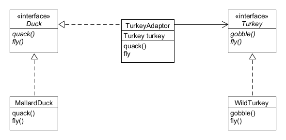
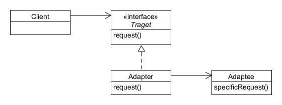

## Adaptor Pattern 이해하기

# 오리 어댑터로 감싼 칠면조 ([TurkeyAdaptor](./TurkeyAdaptor))

##### 칠면조(Turkey)를 Duck interface 로 감쌀 수 있을까?
##### 서로의 규격이 다른데, 어떻게 칠면조를 오리 인터페이스로 만들 수 있을까? 그러려면 그 둘을 잇기 위한 어댑터가 필요할 것이다. 어댑터 패턴은 바로 이럴 때 사용하는 것이다.

# 정의 (Definition)
##### 한 클래스의 인터페이스를 클라이언트에서 사용하고자 하는 다른 인터페이스로 변환한다. 어댑터를 이용하면 인터페이스 호완성 문제 때문에 같이 쓸 수 없는 클래스들을 연결해서 쓸 수 있다.

