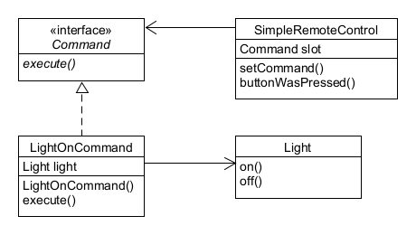
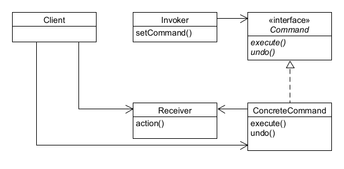
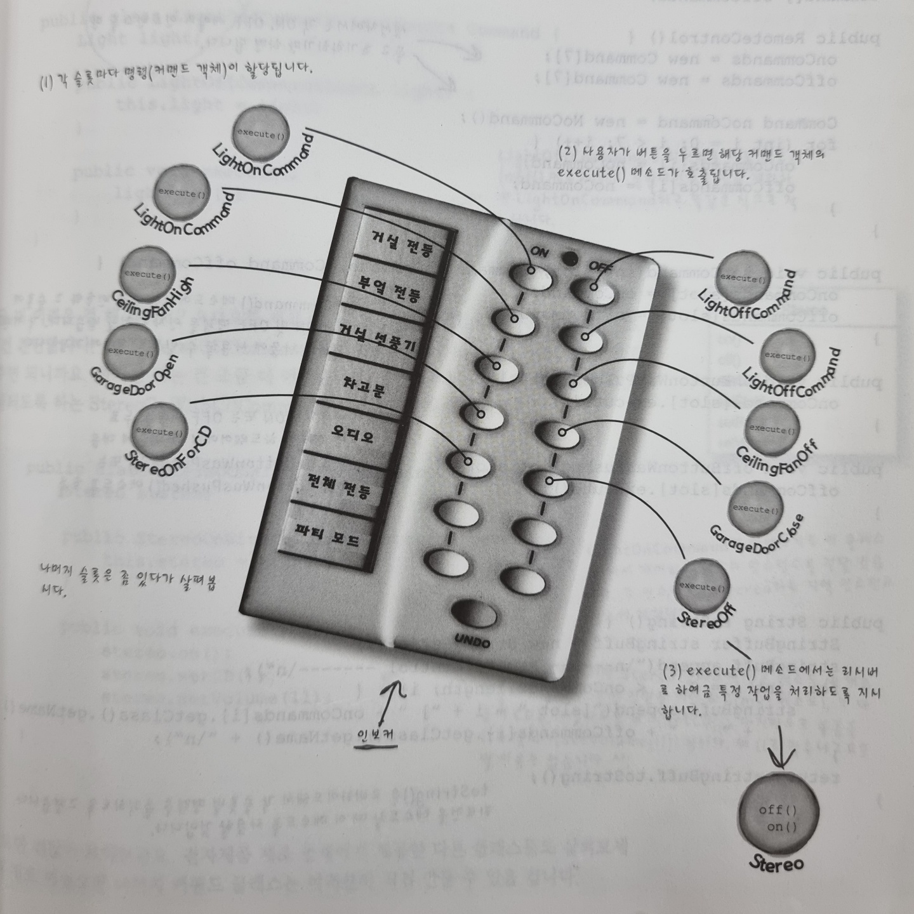
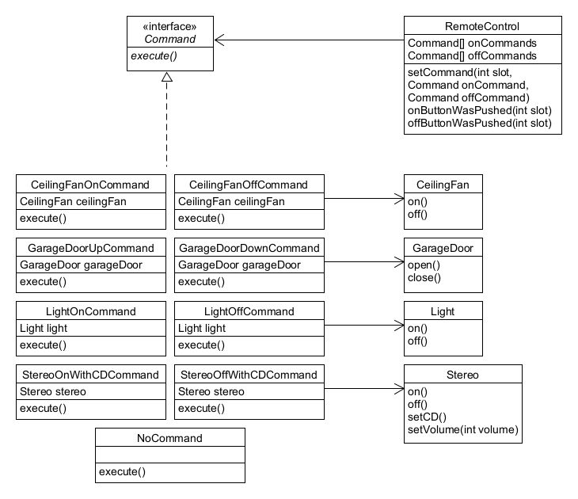

## Command Pattern 이해하기

# 도입 (Intro)
##### 1. createOrder() : 고객이 원하는 것을 주문한다.
##### 2. takeOrder() : 주문(Order)은 계산서와 그 위에 적혀 있는, 고객이 주문한 메뉴 항목으로 구성된다. 여러 고객이 여러 주문서를 매개변수로 전달한다. 하지만 주문이 많아도 별로 어려울 것은 없다. 모든 주문서 객체에는 orderUp() 이라는 메소드가 있고, 그 메소드만 호출하면 식사가 준비될 것이기 때문이다.
##### 3. orderUp() : 웨이트리스는 그 주문을 받아서 주문을 처리하기 위한 준비를 시작하는 orderUp() 메소드를 호출한다. 이 내용은 캡슐화 되어 있기 때문에 웨이트리스는 어떤 내용이 주문되었는지, 누가 식사를 준비할지 등을 전혀 몰라도 된다.
##### 4. makeBurger(), makeShake() : Order 객체에는 음식을 준비하기 위한 모든 지시 사항이 들어있다. Order 객체가 주방장한테 makeBurger() 같은 메소드 호출을 통해 지시를 내린다.
##### 5. 결과 : 주방장은 Order 에서 전달받은 지시사항에 따라 음식을 준비한다. 실제로 식사를 준비하는 방법은 주방장만 알고 있다. 주방장과 웨이트리스는 완전히 분리되어 있다는 점을 잘 살펴보라. 웨이트리스는 각 주문서에 있는 메소드를 호출할 뿐이고, 주방장은 주문서로부터 할 일을 전달 받는다.

# 첫 번째 커맨드 객체 (RemoteController)

# 정의 (Definition)
##### 커맨드 패턴을 이용하면 요구 사항을 객체로 캡슐화 할 수 있으며, 매개변수를 써서 여러 가지 다른 요구 사항을 집어넣을 수도 있다. 또한 요청 내역을 큐에 저장하거나 로그로 기록할 수도 있으며, 작업취소 기능도 지원 가능하다.
##### 커맨드 객체는 일련의 행동을 특정 리시버하고 연결시킴으로써 요구 사항을 캡슐화한 것이다. 이를 위해 행동과 리시버를 한 객체에 집어넣고, execute() 라는 메소드 하나만 외부에 공개하는 방법을 사용한다. 외부에서 볼 때는 어떤 객체가 리시버 역할을 하는지, 그 리시버에서 실제로 어떤 일을 하는지 알 수 없다. 그냥 execute() 메소드를 호출하면 요구 사항이 처리된다는 것만 알 수 있을 뿐이다.

##### Client Class : ConcreteCommand 를 생성하고 Receiver 를 설정한다.
##### Invoker Class : 명령이 들어있으며, execute() 메소드를 호출함으로써 커맨드 객체에게 특정 작업을 수행해 달라는 요구를 하게 된다.
##### Command Interface : 모든 커맨드 객체에서 구현해야 하는 인터페이스. 모든 명령은 execute() 메소드 호출을 통해 수행되며, 이 메소드에서는 리시버에 특정 작업을 처리하라는 지시를 전달한다. 이 인터페이스를 보면 앞선 실행을 취소하는 undo() 메소드도 들어있다.
##### ConcreteCommand : 특정 행동과 리시버 사이를 연결해 준다. 인보커에서 execute() 호출을 통해 요청을 하면 ConcreteCommand 객체에서 리시버에 있는 메소드를 호출함으로써 그 작업을 처리한다. 즉, execute() 메소드에서는 리시버에 있는 메소드를 호출하여 요청된 작업을 수행한다.

# 두 번째 커맨드 객체 (RemoteController2)

##### 이 때, 인보커는 RemoteControl 클래스인 리모콘이고, 리시버는 CeilingFan, GarageDoor, Light, Stereo 등 직접적으로 영향을 받는 물체이다. 각 물체는 각자 자신에 맞는 action 들을 보유하고 있다.