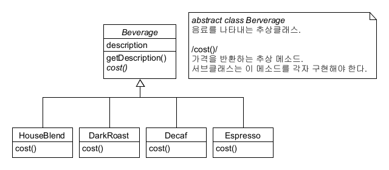
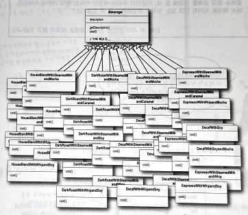
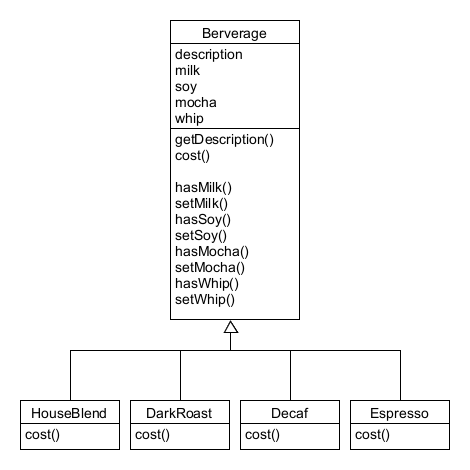
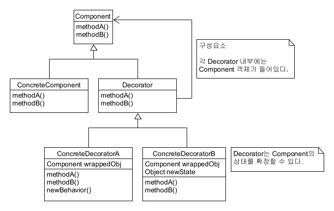
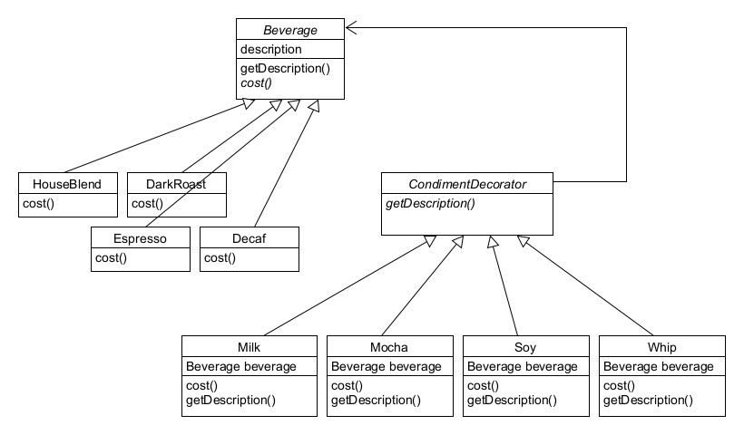

## Decorator Pattern 이해하기

# 도입 (Intro)
##### 여기 스타버즈 커피 전문점이 있습니다. 이 커피 전문점에서는 다양한 커피를 팔고 있으며, 처음에 사업을 시작할 때는 커피의 종류가 그렇게 많지 않아서 다음과 같은 로직으로 구성되어 있었습니다.

# 그러나 문제 발생 !! (Problem)
##### 스타버즈 커피 전문점이 점점 확장함에 따라서 너무나도 다양한 옵션이 생겨났습니다. 커피를 주문할 때 스팀 우유나 두유, 모카(초콜릿)를 추가하기도 하고 휘핑 크림을 얹기도 합니다. 각각을 추가할 때마다 커피의 가격또한 달라지기 때문에, 그런 모든 점들을 고려해야 합니다. 그래서 새로운 커피가 추가될 때마다 일일히 하나씩 전부 추가하게 되었습니다.

##### 으악! 뭐가 뭔지 하나도 모르겠어 ~!!!
##### 결정적으로, OCP ; Open/Close Principle 개방 폐쇄 원칙(소프트웨어 객체는 확장에 대해 열려있어야 하지만, 수정에 대해서는 닫혀있어야 하며, 자신의 변화에 대해서는 폐쇄적이지만, 외부의 변화에 대해서는 확정에 개방적이어야 한다는 원칙)을 준수하고 있지 않다. 

# 해치웠나? (FirstAttempt)

##### 이렇게 만들면 클래스가 5개면 됩니다. 각 커피를 만들었을 때 예를 들어 우유를 추가하고 싶다면, setMilk()를 해주면 그만입니다.
##### 그러나, 정말 이게 최선일까?
##### 첨가물의 가격이 바뀔 때마다 기존 코드를 수정해야 하며, 첨가물의 종류가 많아지면 또 새로운 메소드를 구현해야 하고 cost() 메소드도 고쳐야 합니다. 또한 새로운 음료가 출시되었을 때 예를 들어 Whip()을 절대 추가하지 않을 음료가 추가된다면, Whip() 메소드를 상속받는 것은 불필요한 일이 되어 버립니다.
##### 결정적 문제는, OCP ; Open/Close Principle 개방 폐쇄 원칙을 지키지 않았다는 것입니다.

# 데코레이터 패턴의 정의 (Definition)

###### Intention : Attach additional responsibilities to an object dynamically. Decorators provide a flexible alternative to subclass for extending functionality.
##### 의도 : 데코레이터 패턴에서는 객체의 추가적인 요건을 동적으로 첨가합니다. 데코레이터는 서브클래스를 만드는 것을 통해서 기능을 유연하게 확장할 수 있는 방법을 제공합니다.
###### Motivation : The object that you want to use does the basic functions you require. However, you may need to add some additional functionality to the object, occurring before or after object’s basic functionality.
##### 동기 : 사용할 개체는 필요한 기본 기능을 수행합니다. 그러나 개체의 기본 기능 전후에 발생하는 일부 기능을 개체에 추가해야 할 수도 있습니다.
###### Solution : Allows for extending the functionality of an object without resorting to sub-classing.
##### 해결 : 하위 분류에 의존하지 않고 개체의 기능을 확장할 수 있습니다.

# 데코레이터 패턴 (DecoratorPattern)

