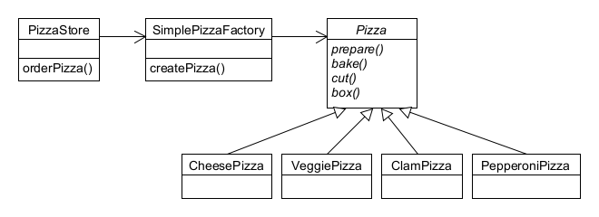

## Factory Pattern 이해하기

# 도입 (Intro)
##### 우리는 인터페이스를 사용해서 구상 클래스의 인스턴스를 만들 것이고 그렇게 만든 인스턴스들을 번갈아가면서 사용할 수 있도록 할 것이다.
`````java
Duck duck;

if (picnic) {
    duck = new MalladDuck();
} else if (hunting) {
    duck = new DecoyDuck();
} else if (inBathTub) {
    duck = new RubberDuck();
}
`````
##### 그러나 위와 같은 방식으로 만들면, 무언가 변경하거나 확장해야 할 때 코드를 다시 확인하고 추가 또는 제거해야 한다는 것을 의미한다. 따라서 이런식으로 코드를 관리하면 코드를 관리하거나 갱신하기에 상당히 힘들어진다.
#### 그러니까, STRIDE 중 OCP(Open/Close Principle)를 위반하게 된다. (소프트웨어 객체는 확장에 대해 열려있어야 하지만, 수정에 대해서는 닫혀있어야 한다는 원칙)

# OCP 구현하기
##### 먼저, 피자 가게를 운영하고 있다고 해보자.
`````java
Pizza orderPizza() {
    Pizza pizza = new Pizza();
    
    pizza.prepare();
    pizza.bake();
    pizza.cut();
    pizza.box();
    return pizza;
}
`````
##### 그러나 피자의 종류가 하나만은 아닐 것이다.
`````java
Pizza orderPizza(String type) {
    Pizza pizza;
    
    if (type.equals("cheese")) {
        pizza = new CheesePizza();
    } else if (type.equals("greek")) {
        pizza = new GreekPizza();
    } else if (type.equls("pepperoni")) {
        pizza = new PepperoniPizza();
    }

    pizza.prepare();
    pizza.bake();
    pizza.cut();
    pizza.box();
    return pizza;
}
`````

# Factory 만들기 (FactoryEncapsulation)


# 피자 가게 프레임워크 - 프랜차이즈 만들기 (PizzaFranchise)