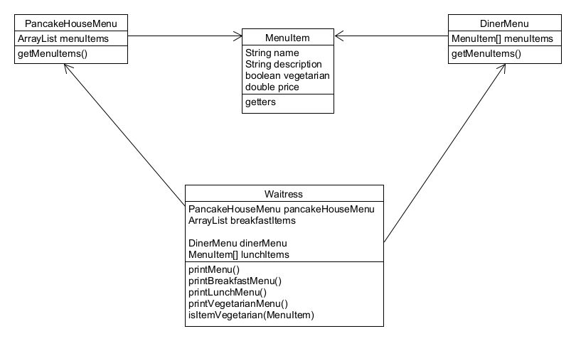

## Iterator Pattern 이해하기

# 문제 발생 ([Problem](./Problem))
#### 여기 서로 다른 두 식당이 있다. 한 식당에서는 데이터를 ArrayList 로 관리하고 다른 한 식당에서는 데이터를 Array 로 관리한다. 이 때 두 식당이 통합하려고 한다. 서로 다른 방식으로 데이터를 관리하고 있었는데, 그렇다고 자료구조부터 데이터를 처음부터 다시 짤 순 없다... 어떡하지?

#### 그래서 Waitress Class 를 두었다. 각 식당의 상황에 맞게 호출하기 위해서 이 Waitress 는 마치 Adaptor Pattern 처럼 상황에 맞게 결합해 주었다.
#### 그럼에도 문제가 있다... 이렇게 되면 Waitress Class 에서 항상 두 메뉴를 이용하고, 각 아이템에 대해서 반복적인 작업을 수행하기 위해 두 개의 순환문을 매번 써야 된다. 만약 또 다른 구현법을 사용하는 음식점이 또 합병된다면 순환문이 세 개가 필요하게 될 것이다.

