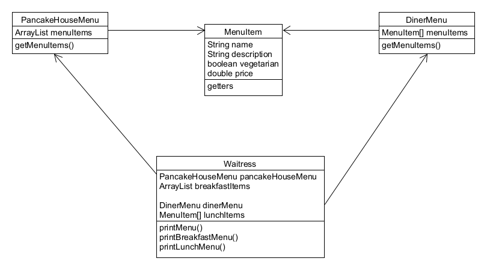

## Iterator Pattern 이해하기

# 문제 발생 ([Problem](./Problem))
#### 여기 서로 다른 두 식당이 있다. 한 식당에서는 데이터를 ArrayList 로 관리하고 다른 한 식당에서는 데이터를 Array 로 관리한다. 이 때 두 식당이 통합하려고 한다. 서로 다른 방식으로 데이터를 관리하고 있었는데, 그렇다고 자료구조부터 데이터를 처음부터 다시 짤 순 없다... 어떡하지?

#### 그래서 Waitress Class 를 두었다. 각 식당의 상황에 맞게 호출하기 위해서 이 Waitress 는 마치 Adaptor Pattern 처럼 상황에 맞게 결합해 주었다.
#### 그럼에도 문제가 있다... 이렇게 되면 Waitress Class 에서 항상 두 메뉴를 이용하고, 각 아이템에 대해서 반복적인 작업을 수행하기 위해 두 개의 순환문을 매번 써야 된다. 만약 또 다른 구현법을 사용하는 음식점이 또 합병된다면 순환문이 세 개가 필요하게 될 것이다.

# Iterator 가 장착된 Waitress ([IteratorWaitress](./IteratorWaitress))
#### 메뉴 구현법이 캡슐화 되었다. Waitress 입장에서는 메뉴에서 메뉴 항목의 컬렉션을 어떤 식으로 저장하는지 전혀 알 수 없다.
#### Iterator 만 구현한다면 어떤 컬렉션이든 다형성을 활용하여 한 개의 순환문으로 처리할 수 있다.
#### Waitress 에서는 인터페이스(Iterator)만 알고 있으면 된다.

#### 그러나 아직 Menu 인터페이스가 완전히 똑같지 않다. Waitress 는 여전히 두 개의 구상 메뉴 클래스에 묶여있다.

# Java 내장 라이브러리로 Iterator 사용하기 ([JavaUtilIterator](./JavaUtilIterator))
#### 자바에는 java.util.Iterator 를 import 해서 사용할 수 있다.
#### ArrayList 의 경우 이 라이브러리를 사용할 수 있기에 PancakeHouseMenu 의 경우 사용이 가능하다.
.png)

# 정의 (Definition)
#### 컬렉션 구현 방법을 노출시키지 않으면서도 그 집합체 안에 들어있는 모든 항목에 접근할 수 있게 해 주는 방법을 제공해 준다.
