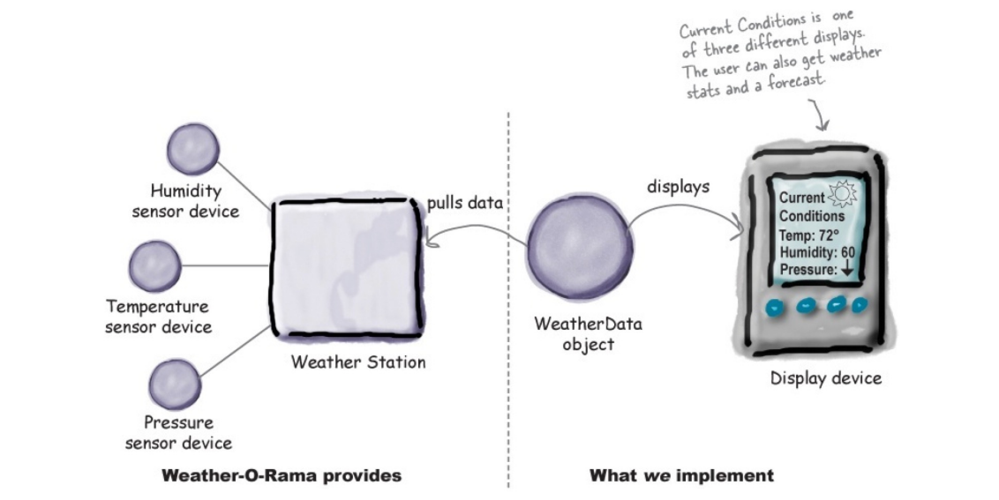
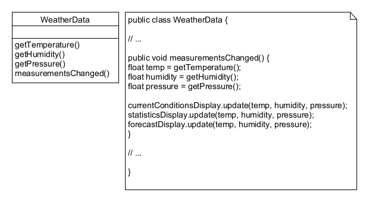
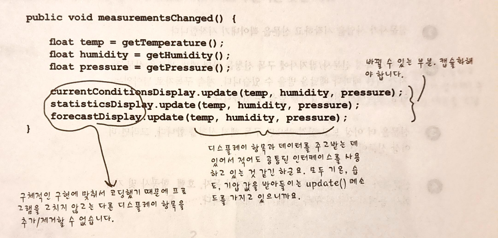
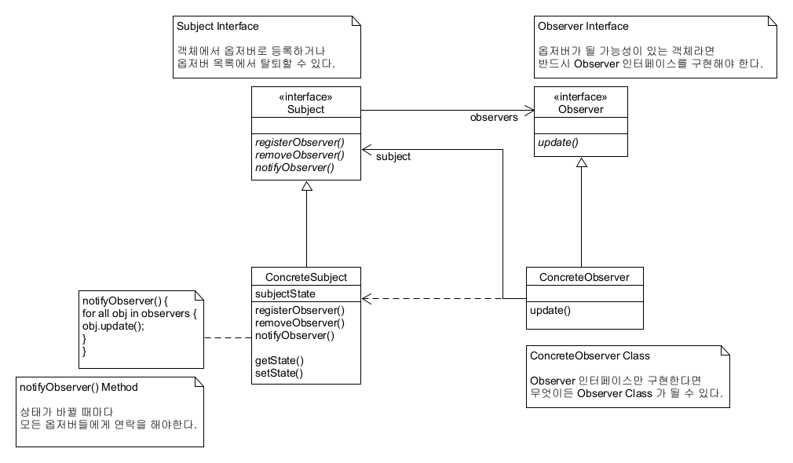
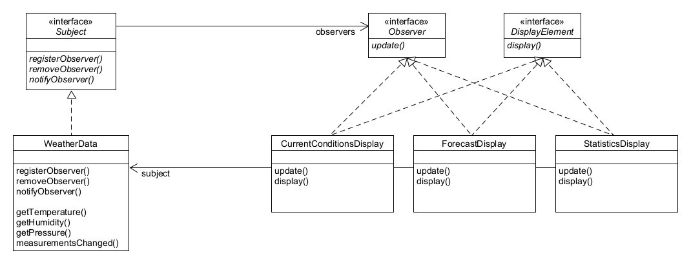
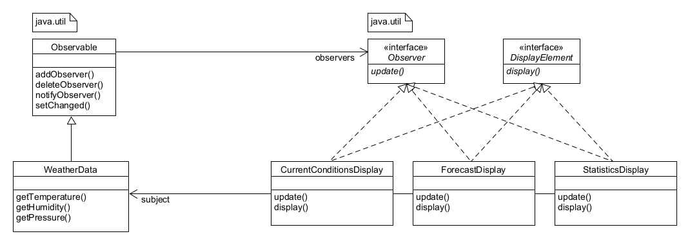

## Observer Pattern 이해하기

# 도입 (Intro)
##### GitHub 에는 pull 과 push 의 개념이 있다. 원격 저장소는 개발자들끼리 데이터의 공유와 갱신을 효율적으로 하기 위함의 목적이 핵심이다. 옵저버패턴은 이와 비슷하다.

##### WeatherData 객체는 기상 스테이션으로부터 데이터를 가져올 수 있다. 데이터를 가져온 후에는 디스플레이 장비에 세 가지 항목을 표시할 수 있다. 첫 번째는 현재 조건(온도, 습도, 압력)이고, 두 번째는 기상 통계, 세 번째는 간단한 기상 예보이다.

##### 데이터가 갱신될 때마다 디스플레이 화면도 갱신해야 했기 때문에, measurementsChanged() 메소드를 위와 같이 생성하게 되었다. 그러나 정말 이게 최선일까?

# 문제점 (Problem)
##### 1. 인터페이스가 아닌 구체적인 구현을 바탕으로 코딩하고 있다. display.update() 메소드들을 살펴보면 공통적인 부분이 눈에 띈다.
##### 2. SOLID 중 OCP;Open/Close Principle(개방/폐쇄 원칙) 을 위반한다. ("소프트웨어 객체는 확장에 대해서 열려있어야 하지만, 수정에 대해서는 닫혀있어야 한다."는 원칙) 실행중에 디스플레이 항목을 추가/제거할 수 없다.
##### 3. SOLID 중 DIP;Dependency Inversion Principle(의존 역전 법칙) 을 위반한다. ("자신보다 변하기 쉬운 것에는 의존하지 않아야 한다."는 원칙) 바뀌는 부분을 캡슐화하지 않았다. 그러니까, 상위 모듈은 하위 모듈의 구현에 의존해서는 안된다. 하위 모듈이 상위 모듈에 정의한 추상 타입에 의존해야 한다.


# 의도 (Intention)
##### 개체 간의 일대다 종속성을 정의하여 한 개체의 상태가 변경되면 모든 종속 개체가 자동으로 알림 및 업데이트되도록 하기 위함이다. 이벤트가 발생했음을 다양한 개체 목록에 알려야 한다. Observer 는 이벤트 모니터링에 대한 책임을 중심 객체(the Subject)에게 위임한다.

# 단점 (Demerit)
##### 어떤 Observer 들에게는 필요 없는 정보까지 알게 될 수도 있다. 모든 Observer 들에게 동일한 정보를 뿌리기 때문이다. 또한, Observer 가 추가 정보를 요청할 경우 추가 통신이 필요할 수도 있다.

# 정의 (Definition)
##### 한 객체의 상태가 바뀌면 그 객체에 의존하는 다른 객체들한테 연락이 가고 자동으로 내용이 갱신되는 방식으로 일대다(one-to-many) 의존성을 정의한다. 대부분의 옵저버패턴은 Subject 인터페이스와 Observer 인터페이스가 들어있는 클래스 디자인을 바탕으로 한다.

# 느슨한 결합 (LooseCoupling)
##### 두 객체가 느슨하게 결합되어 있다는 것은, 그 둘이 상호작용을 하긴 하지만 서로에 대해 서로 잘 모른다는 의미이다. Subject 는 Observer 가 특정 인터페이스를 구현한다는 사실은 알고 있지만, 구체적으로 구상 클래스가 무엇인지, 무엇을 하는지 등에 대해서는 알 필요가 없다. 그에 따라서 다음의 장점들을 가진다.
##### 1. Observer 는 언제든지 새로 추가할 수 있다.
##### 2. Observer 를 추가할 때 Subject 를 전혀 변경할 필요가 없다.
##### 3. Subject 와 Observer 는 서로 독립적으로 재사용할 수 있다.
##### 4. Subject 나 Observer 가 바뀌더라도 서로에게 영향을 미치지 않는다.

# 옵저버패턴 (ObserverPattern)


# 기상 스테이션 구현 예제 ([WeatherStation](./WeatherStation))
##### UML


# 자바 내장 Observable 클래스 ([ObservableClass](./ObservableClass))
##### 자바에서는 자체적으로 옵저버패턴을 지원하고 있다. java.util 패키지에 들어있는 Observer Interface 와 Observable Class 가 그 예시이다. 이 두 클래스는 앞서 WeatherStation 예제에서의 Subject 와 Observer Interface 와 매우 비슷하지만, 더 많은 기능들을 제공한다. 또한 푸시 방식으로 갱신할 수도 있고, 풀 방식으로 갱신할 수도 있다.
##### [java.util.Observer Interface 공식문서 바로가기](https://docs.oracle.com/javase/10/docs/api/java/util/Observer.html)
##### [java.util.Observable Class 공식문서 바로가기](https://docs.oracle.com/javase/10/docs/api/java/util/Observable.html)
##### UML

### setChanged() 메소드가 추가된 이유
##### setChanged() 메소드는 상태가 바뀌었다는 것을 밝히기 위한 용도로 쓰인다. setChanged() 가 호출되지 않은 상태에서 notifyObservers()가 호출되면 Observer 들한테 아무 연락도 가지 않게 된다.
```java
setChanged() {
    changed = true
        }
notifyObservers(Object org) {
    if(changed) {
        목록에 있는 모든 옵저버에 대해 {
            update(this, arg)
        }
        changed = false
    }
}
notifyObservers() {
    notifyObservers(null)
}
```
##### 이러한 setChanged() 메소드가 필요한 이유는 연락을 최적화할 수 있게 해줌으로써 Observer 들을 갱신하는 방법에 있어서 더 광범위한 유연성을 제공하기 위해서이다. 예를 들어, Weather Station 에 있는 온더 센서가 워낙 민감해서 0.1도 단위로 쉴 새없이 값이 바뀐다고 하자. 그러면 WeatherData 에서도 끊임없이 연락을 돌려야 한다. 하지만 필요에 따라 온도가 0.5도 이상 바뀌었을 때만 연락을 돌리고 싶을 때, 바로 그런 경우에 setChanged() 를 조건에 따라 호출함으로써 원하는 바를 달성할 수 있다.
##### 이런 식으로 쓸 일이 거의 없을 수도 있지만, 이렇게 할 수 있다는 것 정도는 알아두는 것이 좋다. 또한, setChanged() 와 같은 방식으로 쓰이는 clearChanged() 라는 메소드도 있는데, 이 메소드는 상태가 변경된 것을 나타내는 changed 플래그를 거짓으로 돌려놓는 역할을 한다. 그리고 hasChanged() 라는 메소드는 changed 플래그의 현재 상태를 알려준다.

# Observable 클래스의 단점
##### 안타깝게도 Observable 은 인터페이스가 아닌 클래스이기 때문에, 서브클래스를 만들어야 한다는 점이 문제점이다. 인터페이스에 맞춰서 프로그래밍해야 한다는 객체지향 디자인 원칙에 위배되기도 하고, 이미 다른 super class 를 확장하고 있는 클래스에 Observable 의 기능을 추가할 수 없다. 그래서 재사용성에 제약이 생기게 된다.
##### Observable Interface 라는 것이 없기 때문에 JAVA 에 내장된 Observer API 하고 잘 맞는 클래스를 직접 구현하는 것이 불가능하다. java.util 구현을 다른 구현으로 바꾸는 것도 불가능하다. (예를 들어 멀티스레드로 구현한다거나 하는 일이 아예 불가능하다.)
##### Observable Class 의 핵심 메소드인 setChanged() 메소드가 protected 로 선언되어 있기 때문에 외부에서 이 메소드를 호출할 수 없다. 결국 특정 외부 클래스에서 Observable 서브클래스를 인스턴스 변수로 사용하는 방법도 써먹을 수가 없다. 이런 디자인은 상속보다 구성을 사용한다는 디자인 원칙에도 위배된다.
