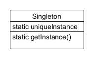
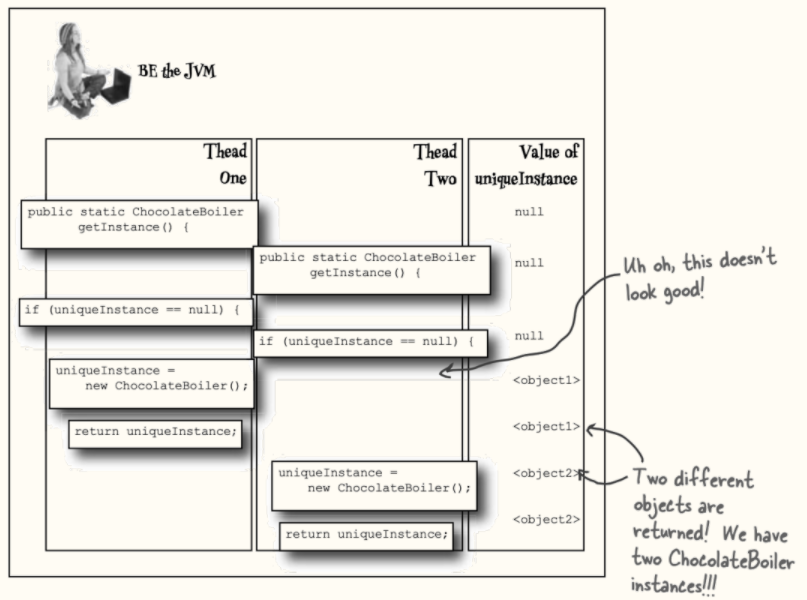

## Singleton Pattern 이해하기

# 고전적인 싱글턴 패턴 (Classic)
`````java
public class Singleton {
    private static Singleton uniqueInstance;
    
    /*
     * 생성자를 private 로 선언했기 때문에 
     * Singleton 내부에서만 클래스의 인스턴스를 생성할 수 있다.
     * */
    private Singleton() { }
    
    public static Singleton getInstance() {
        if (uniqueInstance == null) {
            uniqueInstance = new Singleton();
        }
        return uniqueInstance;
    }
}
`````

# 초콜릿 공장 실습 (ChocolateBoiler)
##### <이전 코드>
`````java
public class ChocolateBoiler {
	private boolean empty;
	private boolean boiled;
  
	public ChocolateBoiler() {
		empty = true;
		boiled = false;
		System.out.println(this);
	}
  
	public void fill() {
		if (isEmpty()) {
			empty = false;
			boiled = false;
			// fill the boiler with a milk/chocolate mixture
		}
	}
 
	public void drain() {
		if (!isEmpty() && isBoiled()) {
			// drain the boiled milk and chocolate
			empty = true;
		}
	}
 
	public void boil() {
		if (!isEmpty() && !isBoiled()) {
			// bring the contents to a boil
			boiled = true;
		}
	}
  
	public boolean isEmpty() {
		return empty;
	}
 
	public boolean isBoiled() {
		return boiled;
	}
}
`````

##### <싱글턴패턴으로 바꾼 코드>
`````java
public class ChocolateBoiler {
	private boolean empty;
	private boolean boiled;
	
	// 클래스 내부에 변수 형태로 유일의 인스턴스 선언
	private static ChocolateBoiler chocolateBoiler = null;
  
	// 생성자가 public -> private 로 바뀌었다.
	private ChocolateBoiler() {
		empty = true;
		boiled = false;
		System.out.println(this);
	}
	
	// 인스턴스를 유일하게 부르기 위한 public 메소드 추가
	public static ChocolateBoiler getInstance() {
	    if (chocolateBoiler == null) {
	        chocolateBoiler = new ChocolateBoiler();
        }
	    return chocolateBoiler;
    }
  
	public void fill() {
		if (isEmpty()) {
			empty = false;
			boiled = false;
			// fill the boiler with a milk/chocolate mixture
		}
	}
 
	public void drain() {
		if (!isEmpty() && isBoiled()) {
			// drain the boiled milk and chocolate
			empty = true;
		}
	}
 
	public void boil() {
		if (!isEmpty() && !isBoiled()) {
			// bring the contents to a boil
			boiled = true;
		}
	}
  
	public boolean isEmpty() {
		return empty;
	}
 
	public boolean isBoiled() {
		return boiled;
	}
}
`````

# 정의 (Definition)
##### 싱글턴 패턴은 해당 클래스의 인스턴스가 하나만 만들어지고, 어디서든지 그 인스턴스에 접근할 수 있도록 하기 위한 패턴이다.


# 그러나, 문제 발생!! (multi-threading)

##### 멀티스레딩으로 코드가 겹치게 되면 우리의 첫 목적을 달성하지 못한다. 서로 다른 인스턴스가 2개나 생기게 되는 것이다.

# 멀티스레딩 해결 (SingletonPattern)
##### 동기화 시키기
```java
public class Singleton {
    private static Singleton uniqueInstance;
    
    private Singleton() { }
    
    public static synchronized Singleton getInstance() {
        if (uniqueInstance == null) {
            uniqueInstance = new Singleton();
        }
        return uniqueInstance;
    }
}
```

##### 인스턴스를 필요할 때 생성하지 말고, 처음부터 만들어 버리기
```java
public class Singleton {
    private static Singleton uniqueInstance = new Singleton();
    
    private Singleton() { }
    
    public static Singleton getInstance() {
        return uniqueInstance;
    }
}
```

##### DCL(Double-Checking Locking)을 사용해서 getInstance()에서 동기화 되는 부분을 줄이기
```java
public class Singleton {
    private volatile static Singleton uniqueInstance;
    
    private Singleton() { }
    
    public static Singleton getInstance() {
        if (uniqueInstance == null) {
            synchronized (Singleton.class) {
                if (uniqueInstance == null) {
                    uniqueInstance = new Singleton();
                }
            }
        }
        return uniqueInstance;
    }
}
```

```java
public class ChocolateBoiler {
	private boolean empty;
	private boolean boiled;
	private volatile static ChocolateBoiler uniqueChocolateBoiler;
  
	private ChocolateBoiler() {
		empty = true;
		boiled = false;
		System.out.println(this);
	}
	
	public static ChocolateBoiler getInstance() {
	    if (uniqueChocolateBoiler == null) {
	        synchronized (this) {
	            if (uniqueChocolateBoiler == null) {
	                uniqueChocolateBoiler = new ChocolateBoiler();
                }
            }
        }
	    return uniqueChocolateBoiler;
    }
  
	public void fill() {
		if (isEmpty()) {
			empty = false;
			boiled = false;
			// fill the boiler with a milk/chocolate mixture
		}
	}
 
	public void drain() {
		if (!isEmpty() && isBoiled()) {
			// drain the boiled milk and chocolate
			empty = true;
		}
	}
 
	public void boil() {
		if (!isEmpty() && !isBoiled()) {
			// bring the contents to a boil
			boiled = true;
		}
	}
  
	public boolean isEmpty() {
		return empty;
	}
 
	public boolean isBoiled() {
		return boiled;
	}
}
```