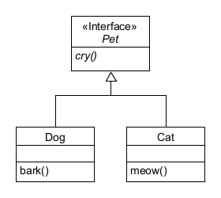
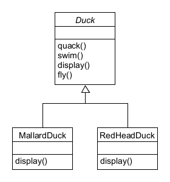
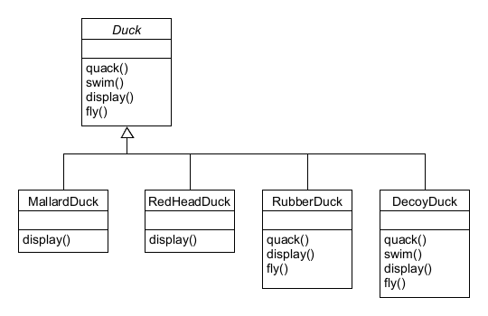

# Strategy Pattern 이해하기

### 도입 (Intro)
##### 우리는 자바의 다형성을 사랑한다. 지금껏 Pet interface 를 상속받는 Dog class 와 Cat class 를 만들면서 인터페이스 구현을 이용해 다형성을 지켰다며 뿌듯해했다. 그러나, 정말 이게 최선일까?

### 추상 클래스 상속 다형성 구현 (AbstractClass)
##### 평소처럼 상속을 이용해 다형성을 구현하기 위해서 Duck 추상 클래스를 만들었다. 그리고 그 클래스를 MallardDuck Class, RedHeadDuck Class 가 상속을 하도록 만들었다.

##### 그러나 문제점이 발생했다. 이 상태에서 RubberDuck 클래스와 DecoyDuck 클래스가 추가된다면 어떨까?

##### 언뜻 보면 별 문제 없는 코드처럼 보인다. 그러나 RubberDuck(고무오리)는 꽥꽥소리를 낼 수도 없고, 날 수도 없다. 단지 던져질 뿐이다. 그렇기 때문에 quack() 메소드와 fly() 메소드 둘 다를 모두 추가해서 Override 해야한다. DecoyDuck(모형오리)의 경우에도 상황은 비슷하다. 심지어 모형오리는 수영까지도 할 수 없다! 모든 메소드들을 다 Override 한 것이다. 이렇게 되면, 추상클래스를 상속하는 것에 대한 가치가 충분했을까?

###### 뭐가 문제라는거지?
#### Duck 클래스의 "상속" 시의 문제점이 뭘까?
##### 첫 째, 서브클래스에서 코드가 중복된다.
###### 모든 오리들의 swim 에 대한 행동과 fly 에 대한 행동들 등등이 모두 같아지고 만다. 아무리 같은 오리 종이더라도 세상에 완벽히 똑같은 행동을 하는 오리는 없다!
##### 둘 째, 실행 시에 특징을 바꾸기 힘들다.
###### 오리별로 특징을 살리는 수정을 할 수 있을까? 혹은 수정시에 모든 오리들에게 적절한 수정을 할 수 있을까?
##### 셋 째, 모든 오리의 행동을 알기 힘들다.
###### 코드를 면밀히 들여다보지 않는 이상, 이 오리가 도대체 정확히 무슨 행동을 하는지 알 수 없다.
##### 넷 째, 코드를 변경했을 때 다른 오리들한테 원치 않는 영향을 끼칠 수 있다.
###### 한 마리의 오리에 대해서만 특징을 살리는 수정을 하고 싶은데, 추상 클래스의 메소드를 변경하면 모든 오리에게 영향을 미치게 되고 만다.