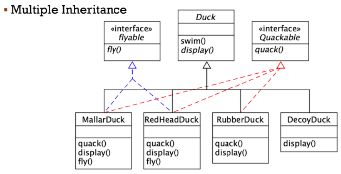
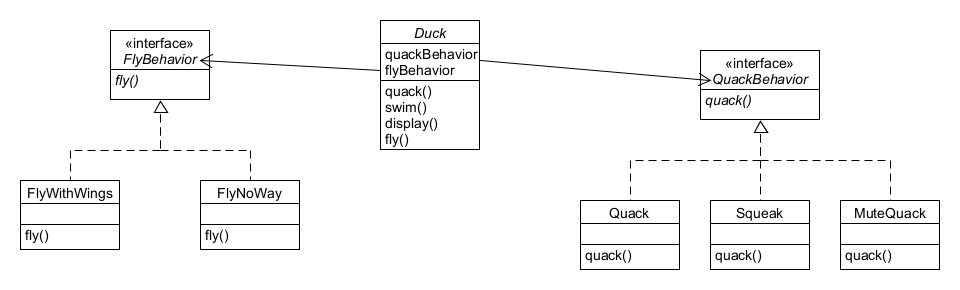

## Strategy Pattern 이해하기

# 도입 (Intro)
##### 우리는 자바의 다형성을 사랑한다. 지금껏 Pet interface 를 상속받는 Dog class 와 Cat class 를 만들면서 인터페이스 구현을 이용해 다형성을 지켰다며 뿌듯해했다. 그러나, 정말 이게 최선일까?


# 추상 클래스 상속 다형성 구현 (AbstractClass)
##### 평소처럼 상속을 이용해 다형성을 구현하기 위해서 Duck 추상 클래스를 만들었다. 그리고 그 클래스를 MallardDuck Class, RedHeadDuck Class 가 상속을 하도록 만들었다.


##### 그러나 문제점이 발생했다. 이 상태에서 RubberDuck 클래스와 DecoyDuck 클래스가 추가된다면 어떨까?

##### 언뜻 보면 별 문제 없는 코드처럼 보인다. 그러나 RubberDuck(고무오리)는 꽥꽥소리를 낼 수도 없고, 날 수도 없다. 단지 던져질 뿐이다. 그렇기 때문에 quack() 메소드와 fly() 메소드 둘 다를 모두 추가해서 Override 해야한다. DecoyDuck(모형오리)의 경우에도 상황은 비슷하다. 심지어 모형오리는 수영까지도 할 수 없다! 모든 메소드들을 다 Override 한 것이다. 이렇게 되면, 추상클래스를 상속하는 것에 대한 가치가 충분했을까?

###### 뭐가 문제라는거지?
#### Duck 클래스의 "상속" 시의 문제점이 뭘까?
##### 첫 째, 서브클래스에서 코드가 중복된다.
###### 모든 오리들의 swim 에 대한 행동과 fly 에 대한 행동들 등등이 모두 같아지고 만다. 아무리 같은 오리 종이더라도 세상에 완벽히 똑같은 행동을 하는 오리는 없다!
##### 둘 째, 실행 시에 특징을 바꾸기 힘들다.
###### 오리별로 특징을 살리는 수정을 할 수 있을까? 혹은 수정시에 모든 오리들에게 적절한 수정을 할 수 있을까?
##### 셋 째, 모든 오리의 행동을 알기 힘들다.
###### 코드를 면밀히 들여다보지 않는 이상, 이 오리가 도대체 정확히 무슨 행동을 하는지 알 수 없다.
##### 넷 째, 코드를 변경했을 때 다른 오리들한테 원치 않는 영향을 끼칠 수 있다.
###### 한 마리의 오리에 대해서만 특징을 살리는 수정을 하고 싶은데, 추상 클래스의 메소드를 변경하면 모든 오리에게 영향을 미치게 되고 만다.

# 인터페이스로 특징 메소드 구현 (Interface)
##### 그렇다면 인터페이스를 활용해보자! 일단, 던지는 행동과 울음 소리를 내는 행동에서 차이가 많이 갈리므로 그 둘의 행동에 대해서 인터페이스로 정의해보자.

##### 안타깝게도, 이 또한 좋은 선택이 아니다. 코드는 또 다시 중복될 것이기 때문이다. 이렇게 할 바에는 차라리 상속 Override 방식이 더 나을 수도 있다. 그러니까, 서브클래스마다 오리의 행동이 바뀔 수 있는데도 모든 서브클래스에서 한 행동을 사용하도록 했기 때문에 좋지 않은 것이다. 해당 인터페이스를 구현하는 모든 서브클래스가 각자 개별로 정의되어야 하며, 또 행동을 바꿀 때마다 그 행동이 정의되어 있는 서로 다른 서브클래스들을 전부 찾아서 코드를 일일히 고쳐야 한다.
##### 그리고, 가장 중요한 문제점이 있다. 바로 디자인패턴의 5가지 설계원칙 SOLID 중 첫 번째 원칙인 "SRP ;Single Responsibility Principle" 단일 책임 원칙을 위배한다는 것이다. "모든 클래스는 하나의 책임만을 가져야" 하는 데 그러지 못하고 있다.

# 인터페이스로 행동을 정의하고 특징별로 클래스 만들기 (StrategyPattern)

#### 이것이 바로 strategy pattern 이다.
##### 각 행동은 인터페이스 FlyBehavior, QuackBehavior 로 표현하고 행동을 구현할 때 이런 인터페이스를 구현하도록 한다. 즉, 특정 행동만을 목적으로 하는 클래스의 집합을 만들게 된 것이다. 행동(behavior) 인터페이스는 Duck 클래스가 아닌 행동 클래스에서 구현한다.
##### 핵심은 다음과 같다. 전에 사용했던 방법들은 "구현"에 의존했다. 특정 구현을 사용해야만 했기 때문에 행동을 변경할 여지가 없었다. 그러나 새로운 디자인(strategy pattern)을 사용하면 Duck의 서브클래스에서는 인터페이스(behavior)로 표현되는 행동을 하게 된다. 따라서 행동을 실제로 구현한 것(FlyBehavior 나 QuackBehavior 를 구현하는 클래스에 코딩되어 있는 구체적인 특정 행동)은 Duck 서브클래스에 국한되지 않는다.

# Questions.
#### 왜 추상 클래스를 사용하지 않고 인터페이스를 사용하는가?
##### "인터페이스에 맞춰 프로그래밍한다." 는 "상위 형식에 맞춰서 프로그래밍한다." 는 의미이다. 핵심은, 실제 실행 시에 쓰이는 객체가 코드에 의해서 고정되지 않도록, 어떤 상위 형식(supertype)에 맞춰서 프로그래밍함으로써 다형성을 활용해야 한다는 것이다.
##### "상위 형식에 맞춰서 프로그래밍 하라." == 변수를 선언할 때는 보통 추상 클래스나 인터페이스 같은 상위 형식으로 선언해야 한다. 객체를 변수에 대입할 때 상위 형식을 구체적으로 구현한 형식이라면 어떤 객체든 집어넣을 수 있기 때문이다. 그렇게 하면 변수를 선언하는 클래스에서 실제 객체의 형식을 몰라도 된다.

#### 예시 Example
##### 구현에 맞춘 프로그래밍
```
Dog d = new Dog();
d.back();
```
##### 인터페이스/상위 형식에 맞춘 프로그래밍
```
Animal animal = new Dog();
animal.makeSound();
```
##### 그보다 더 좋은 코드 !
##### 상위 형식의 인스턴스를 만드는 과정을 직접 코드(new Dog();)로 만드는 대신 구체적으로 구현된 객체를 실행 시에 대입하는 것.
```
a = getAnimal();
a.makeSound();
```