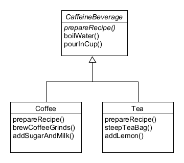
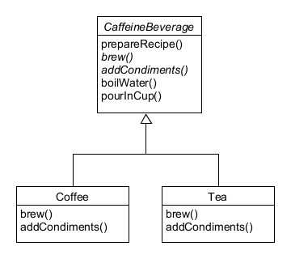
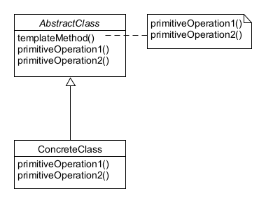

## Template Method Pattern 이해하기

# 커피와 홍차 클래스 만들기 ([CaffeineBeverage](./CaffeineBeverage))

##### 커피와 홍차는 비슷한 점이 많아서 동일한 추상클래스를 상속받고 있다.
##### 그러나, prepareRecipe()까지 추상화 시킬 수 있는 법은 없을까?

# prepareRecipe() 추상화하기 ([TemplateMethodPattern](./TemplateMethodPattern))

# 정의 (Definition)
##### 메소드에서 알고리즘의 골격을 정의한다. 알고리즘의 여러 단계 중 일부는 서브클래스에서 구현할 수 있다. 템플릿 메소드를 이용하면 알고리즘의 구조는 그대로 유지하면서 서브클래스에서 특정 단계를 재정의할 수 있다.
