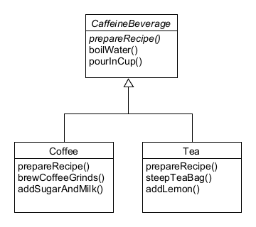

## Template Pattern 이해하기

# 커피와 홍차 클래스 만들기 ([CaffeineBeverage](./CaffeineBeverage))

##### 커피와 홍차는 비슷한 점이 많아서 동일한 추상클래스를 상속받고 있다.
##### 그러나, prepareRecipe()까지 추상화 시킬 수 있는 법은 없을까?

# prepareRecipe() 추상화하기 ([AbstractPrepare](./AbstractPrepare))
